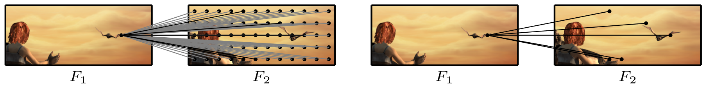

# Learning Optical Flow from a Few Matches
This repository contains the source code for our paper:

[Learning Optical Flow from a Few Matches](https://arxiv.org/abs/2104.02166)<br/>
CVPR 2021 <br/>
**Shihao Jiang**, Yao Lu, Hongdong Li, Richard Hartley<br/>
ANU<br/>



## Requirements
The code has been tested with PyTorch 1.6 and Cuda 10.1.
```Shell
conda create --name scv
conda activate scv
conda install pytorch=1.6.0 torchvision=0.7.0 cudatoolkit=10.1 matplotlib tensorboard scipy opencv -c pytorch
pip install faiss-gpu
```

## Required Data
To evaluate/train SCV, you will need to download the required datasets. 
* [FlyingChairs](https://lmb.informatik.uni-freiburg.de/resources/datasets/FlyingChairs.en.html#flyingchairs)
* [FlyingThings3D](https://lmb.informatik.uni-freiburg.de/resources/datasets/SceneFlowDatasets.en.html)
* [Sintel](http://sintel.is.tue.mpg.de/)
* [KITTI](http://www.cvlibs.net/datasets/kitti/eval_scene_flow.php?benchmark=flow)
* [HD1K](http://hci-benchmark.iwr.uni-heidelberg.de/) (optional)


By default `datasets.py` will search for the datasets in these locations. You can create symbolic links to wherever the datasets were downloaded in the `datasets` folder

```Shell
├── datasets
    ├── Sintel
        ├── test
        ├── training
    ├── KITTI
        ├── testing
        ├── training
        ├── devkit
    ├── FlyingChairs_release
        ├── data
    ├── FlyingThings3D
        ├── frames_cleanpass
        ├── frames_finalpass
        ├── optical_flow
```

## Evaluation
You can evaluate a trained model using `evaluate.py`
```Shell
python evaluate.py --model=checkpoints/quarter/scv-chairs.pth --dataset=chairs
```

## Training
We used the following training schedule in our paper (2 GPUs).
```Shell
./train.sh
```

## License
WTFPL. See [LICENSE](LICENSE) file. 

## Acknowledgement
The overall code framework is adapted from [RAFT](https://github.com/princeton-vl/RAFT). We
thank the authors for the contribution. 
